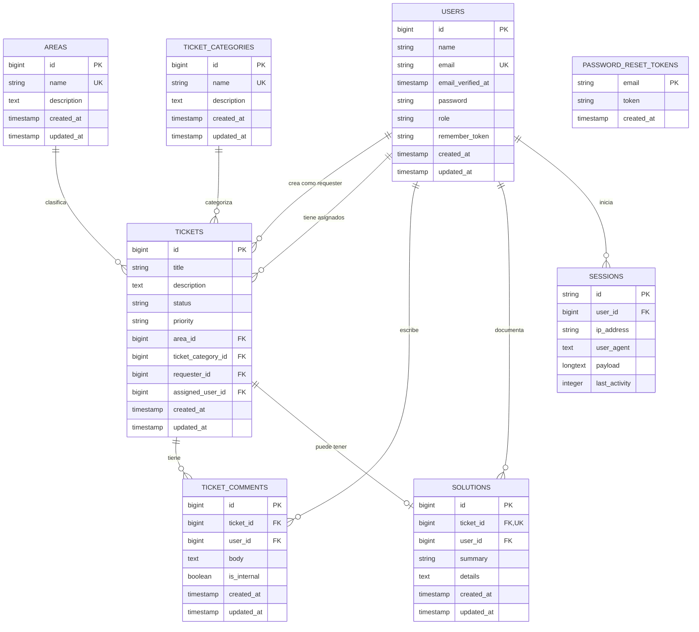

# Diagrama de entidad relacion

Este DER se basa en las migraciones y modelos actuales del proyecto.

## Reglas principales

- Un usuario puede crear muchos tickets mediante `tickets.requester_id`.
- Un usuario tecnico o administrador puede tener muchos tickets asignados mediante `tickets.assigned_user_id`; este campo puede ser nulo.
- Un area puede estar asociada a muchos tickets.
- Una categoria puede estar asociada a muchos tickets.
- Un ticket puede tener muchos comentarios.
- Cada comentario pertenece a un ticket y a un usuario.
- Un ticket puede tener como maximo una solucion porque `solutions.ticket_id` es unico.
- Cada solucion pertenece a un ticket y al usuario que la documento.
- `password_reset_tokens` y `sessions` son tablas auxiliares de autenticacion/sesion de Laravel.

## Cardinalidades resumidas

| Relacion | Cardinalidad |
| --- | --- |
| `users` a `tickets` como solicitante | 1 a N |
| `users` a `tickets` como asignado | 1 a N opcional desde `tickets` |
| `areas` a `tickets` | 1 a N |
| `ticket_categories` a `tickets` | 1 a N |
| `tickets` a `ticket_comments` | 1 a N |
| `users` a `ticket_comments` | 1 a N |
| `tickets` a `solutions` | 1 a 0..1 |
| `users` a `solutions` | 1 a N |
| `users` a `sessions` | 1 a N opcional desde `sessions` |
